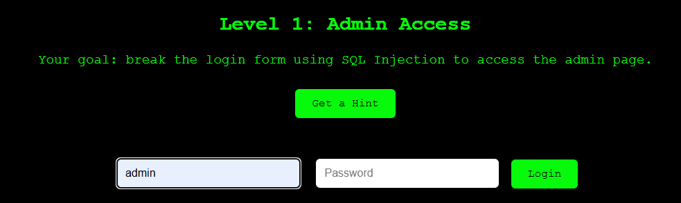
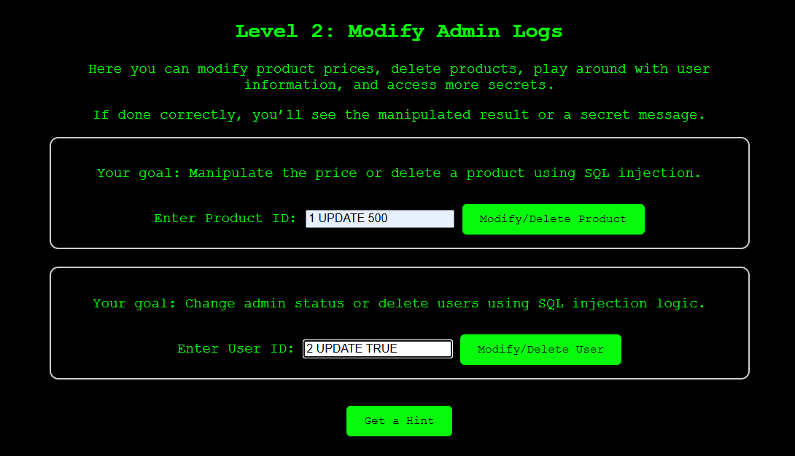
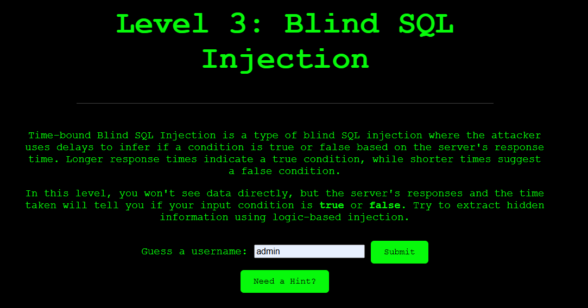

# SQLi Challenges

This is a simple, fun app created to try out SQL injections.

### Prerequisites

* Python 3.11+ recommended
* `pip` installed

### Installation Steps

1. Clone this repository:

```bash
git clone https://github.com/YOUR_USERNAME/REPO_NAME.git
cd REPO_NAME
```

2. Install Dependencies:

```bash
pip install -r requirements.txt
```

3. Seed the database:

```bash
python seed_users.py
python seed_products.py
```

4. Run the app!

```bash
python app.py
```

### SQLi Challenges

\##Level 1

Try logging into the admin page by injecting different payloads into the password field until you gain access.



\##Level 2

Exploit the product and user input fields to delete or update records.


\##Level 3

Guess and enter random usernames to infer whether or not they exist in the database (based on response time)


